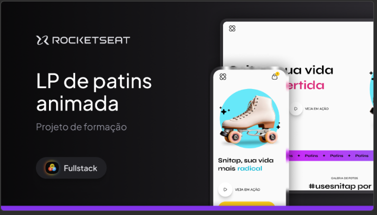

# 🛼 Projeto Snitap - Patins

Neste projeto, desenvolvi uma interface baseada em um layout de patins criado no Figma, com o objetivo de estudar e aplicar animações e transições utilizando CSS de forma prática e visualmente agradável.

<br>

<p align="center">
  
</p>

## 🔖 Layout

Você pode visualizar o layout do projeto através [neste link](https://www.figma.com/community/file/1379866810042169871).<br> É necessário ter conta no [Figma](https://figma.com) para acessá-lo.

## 🎯 Objetivos

- Aprimorar habilidades em **CSS Animations** e **Transitions**;
- Aplicar conceitos modernos de interação e movimento em interfaces;
- Utilizar um layout do Figma como base de estrutura e design.

## ✨ Funcionalidades implementadas

- ✅ **Animações por clique:** elementos interativos com movimento para melhorar a experiência do usuário;
- ✅ **Transições suaves no hover:** efeitos de transição ao passar o mouse, destacando botões e áreas clicáveis;
- ✅ **Animação com scroll:** elementos que aparecem ou se transformam à medida que o usuário navega pela página.

## 💻 Tecnologias utilizadas

- HTML5  
- CSS3 (com foco em keyframes, transition e transform)  
- Figma (como referência visual)

## ▶️ Como executar

1. Clone o repositório:
   ```bash
   git clone https://github.com/danillo-fullstack/projeto-fullstack-patins

2. Acesse a pasta do projeto:
   ```bash
   cd nome-do-repo

- [Acesse o projeto finalizado, online](https://danillo-fullstack.github.io/projeto-fullstack-patins/)

---

Feito em parceria com a Rocketseat